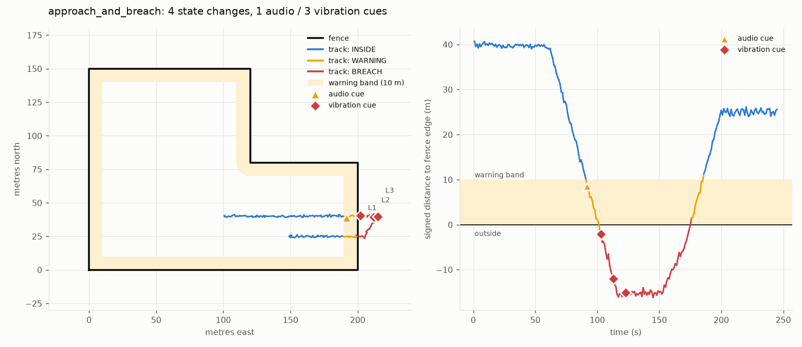
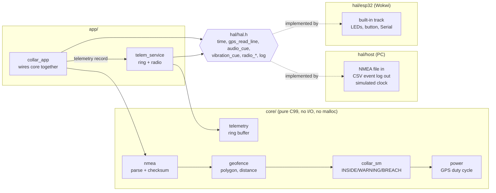
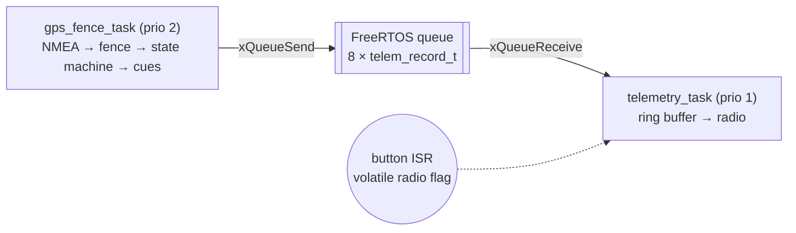

# Virtual Fence Collar Firmware (simulated)

Firmware for a GPS livestock collar that enforces a **virtual fence**: no
posts or wire, just a polygon on a map. When an animal walks towards the
boundary the collar plays a sound. If it keeps going and crosses, the collar
vibrates, more strongly over time. When it walks back in, the cues stop.
Background on the idea: [Virtual fence (Wikipedia)](https://en.wikipedia.org/wiki/Virtual_fence).

> **No physical hardware is involved.** Everything runs as a **host simulation
> on a PC** (GPS replayed from NMEA files, cues written to an event log) plus an
> **ESP32 simulation in [Wokwi](https://wokwi.com)** (LEDs stand in for the
> speaker and the vibration motor). It is a learning and portfolio project, not
> a product.



*Above: the `approach_and_breach` scenario. The cow walks east, gets an audio
cue in the 10 m warning band, crosses the fence, and gets three escalating
vibrations. Then it walks back in and the collar goes quiet. Right panel:
signed distance to the fence edge over time.*

## Features

- **NMEA 0183 parser** for `$GPGGA` and `$GPRMC`. Validates the XOR checksum,
  rejects malformed lines, and counts rejections. No `strtod`, no `malloc`.
- **Geofence** on any polygon, including concave ones. Uses an equirectangular
  projection to local metres, ray-casting point-in-polygon, and distance to the
  nearest edge.
- **State machine** INSIDE → WARNING (audio) → BREACH (vibration, escalating
  every 10 s up to a welfare cap). Hysteresis needs **2 consecutive fixes** to
  change state, and with no fix it holds state and never cues.
- **GPS duty cycling**: if the animal moves < 2 m in 60 s, sample every 30 s
  instead of every 1 s. It goes back to 1 s on movement or near the fence.
- **Telemetry ring buffer** (32 records). While the radio is offline, records
  queue; when full, the oldest is dropped and counted. Records flush oldest-first
  on reconnect.
- **HAL** with two backends: a PC simulator and an Arduino-ESP32 version that
  uses **FreeRTOS tasks + a queue**.
- **54 Unity unit tests**, **7 pytest end-to-end scenarios**, and a GitHub
  Actions CI workflow.

## Architecture



On the ESP32 the app runs as two FreeRTOS tasks:



Only `telemetry_task` touches the ring buffer, so the buffer needs no mutex.
The queue is the only shared object between the tasks.

## Repository layout

```
core/        nmea, geofence, collar_sm, power, telemetry   (hardware-independent)
hal/         hal.h interface; host/ (PC) and esp32/ (Arduino) implementations
app/         collar_app (glue), main_host.c (PC entry), sketch.ino (ESP32 entry)
tests/unit/  Unity tests, one file per core module
tests/       test_scenarios.py (pytest end-to-end); esp32_stub/ (compile-check headers)
tools/       gen_track.py, plot_run.py, run_all.py, sync_wokwi.py
wokwi/       flat copy for wokwi.com + diagram.json + README with steps
third_party/unity/   ThrowTheSwitch Unity (MIT)
docs/        scenario plots
```

## Build, test, run

You need GCC (or Clang), CMake ≥ 3.16, optionally Ninja, and Python 3 with
`pytest` and `matplotlib`.

<details><summary>Windows setup used for this repo</summary>

```bash
winget install -e --id BrechtSanders.WinLibs.POSIX.UCRT
```
WinLibs ships GCC, CMake and Ninja. `tools/run_all.py` finds it even if it is
not on `PATH`. Then install the Python packages:
```bash
python -m pip install pytest matplotlib
```
</details>

**Everything in one command:** build, unit tests, scenario tests, plots, Wokwi
sync, and the ESP32 compile check.

```bash
python tools/run_all.py
```

Or step by step:

```bash
cmake -S . -B build -G Ninja
cmake --build build
ctest --test-dir build --output-on-failure      # Unity unit tests
python -m pytest tests -v                        # end-to-end scenarios
```

Run one scenario by hand and plot it:

```bash
python tools/gen_track.py approach_and_breach --out build/abr.nmea --noise 0.5
build/collar_sim build/abr.nmea build/abr.csv
python tools/plot_run.py approach_and_breach --csv build/abr.csv --out build/abr.png
```

`collar_sim` options: `--radio-offline FROM_S:TO_S`, `--confirm N` (hysteresis
depth, `1` = off), `--quiet`.

## Scenario results

These numbers come from the `SUMMARY` line of each run (`python -m pytest tests`).
Tracks are deterministic (seed 1).

| Scenario | What happens | State changes | Audio | Vibration | Other |
|---|---|---:|---:|---:|---|
| `grazing_inside` | 300 s random walk ≥ 25 m from the edge | 0 | 0 | 0 | |
| `approach_and_breach` | walk out through the warning band, stay out 35 s, walk back | 4 | 1 | 3 (levels 1, 2, 3) | ends INSIDE |
| `gps_noise_at_boundary` | stand 2.5 m inside the edge, σ = 1.2 m noise | 1 | 1 | **0** | 2 single fixes outside, both ignored |
| ↳ same track, `--confirm 1` | hysteresis disabled | 7 | 2 | **2 (false)** | shows the flapping that hysteresis prevents |
| `bad_gps` | 24 corrupted checksums, 4 junk lines, 30 s without fix | 0 | 0 | 0 | 28 rejected, 1 unsupported, 30 `NO_FIX` |
| `stationary_cow` | stand still 200 s, then walk | 0 | 0 | 0 | 1 s → 30 s at t=89 s, → 1 s at t=239 s; 165 GPS samples in 310 s |
| `radio_offline` | radio off from 60 s to 500 s | 0 | 0 | 0 | 56 records dropped (oldest), 32 flushed on reconnect |

Plots for every scenario are in [`docs/`](docs/).

## ESP32 / Wokwi

See [`wokwi/README.md`](wokwi/README.md) for step-by-step browser
instructions. The ESP32 code has been **compile-checked on the PC against stub
headers only**. It has not been built with the real ESP32 toolchain or run in
Wokwi yet.

## Further reading in this repo

- [`LEARNING.md`](LEARNING.md): module-by-module explanation, C concepts, and
  interview Q&A (in Chinese).
- [`REPORT.md`](REPORT.md): build report with raw test output.
